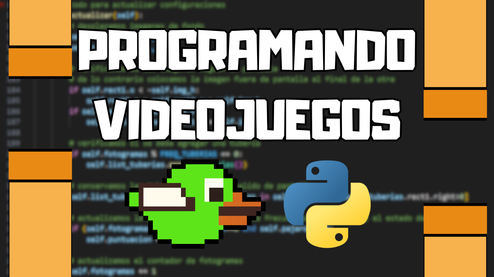

## 📢 Sigue el proyecto CodeDog
¡Bienvenido a este repositorio! 👋  
Aquí encontrarás el código utilizado en uno de los videos del proyecto **CodeDog** 🐶💻, donde exploramos conceptos fascinantes del mundo de las **Ciencias de la Computación** de forma clara y práctica, incluyendo temas como:
- 🤖 **Machine Learning**
- 🧠 **Inteligencia Artificial**
- 🧬 **Inteligencia Computacional**
- 💻 **Programación**

Si te interesa aprender más sobre estos temas y apoyar el contenido, no olvides seguirnos en nuestras redes sociales:
- ▶️ **[YouTube](https://www.youtube.com/channel/UCc6iP4H2xYFXYGkSx9Xtmig)**
- 🎵 **[TikTok](https://www.tiktok.com/@code.dog?_r=1&_t=ZS-93R2fwIZ9rI)**

¡Gracias por visitar el repositorio y feliz programación! 🚀🐾


# 🎮 Programando un videojuego en Python
Este repositorio contiene el codigo usado en el video [YYY](https://youtu.be/y_8kiSQ7aAY), en el cual se explica detalladamente el funcionamiento de un videojuego, y se programa uno desde cero para mostrar todo el proceso y las consideraciones necesarias para realizar toda la implementación.



## Descripción de archivos
Encontraras los siguientes archivos:
 - [game_code_1.py](game_code_1.py): version base del juego implementado en el video
 - [game_code_2.py](game_code_2.py): segunda version del juego, agregando movimiento vertical a las tuberias
 - [imgs](imgs): carpeta con todas las imagenes y sprites necesarias para correr el juego
 - [Animaciones](Animaciones): carpeta con las animaciones usadas en este video (usando Manim)

## Instalación
Descarga o clona este proyecto:
```bash
git clone https://github.com/codedog-videos/Videojuegos-con-Python.git
```

cambia el directorio a la carpeta descargada:
```bash
cd Videojuegos-con-Python
```

utitliza las siguientes instrucciones para correr alguna version del juego:
```bash
python game_code_1.py
```

```bash
python game_code_2.py
```

El juego tiene unicamente 2 controles:
- ESPACIO: para saltar
- R: para reiniciar el juego
